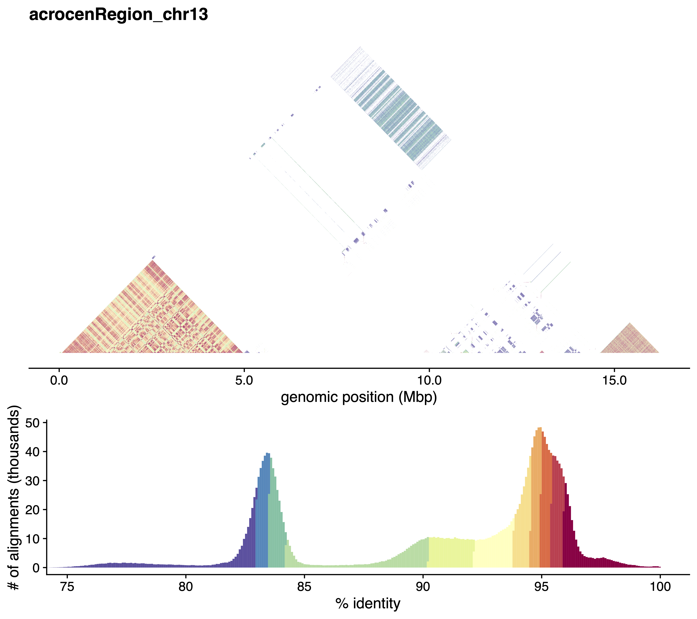

# StainedGlass

This is repository that makes colorful dot alignment plots.



## Installation 

You will need a current version of `snakemake` to run the code. Please follow the install [instructions](https://snakemake.readthedocs.io/en/stable/getting_started/installation.html).

Afterwards you can download the repository and additional installs will be handled by `snakemake`.
```
git clone https://github.com/mrvollger/StainedGlass.git
```

## Running

Choose a sample identifier for your run e.g. `chr8` and a fasta file on which you want to show the colorful alignments and the modify the config file `StainedGlass.yaml` accordingly.
```
sample: small
fasta: test/small.fasta
```

Once this is done you can run the pipeline like so:
```
./StainedGlass.sh --cores 24 
```
Or do a dry run of the pipeline
```
./StainedGlass.sh --cores 24 -n
```
Please try the test case with the default configuration file before submitting issues.

### Making figures for a small number of regions
To make pdfs and pngs for a particular set of regions just add `make_figures` to your command.
```
./StainedGlass.sh --cores 24 make_figures
```


### Making a visualization for the whole genome
This requires the use of the program [HiGlass](https://higlass.io/) and a web browser. But to make the necessary input files for that you can run:
```
./StainedGlass.sh --cores 24 cooler
```
